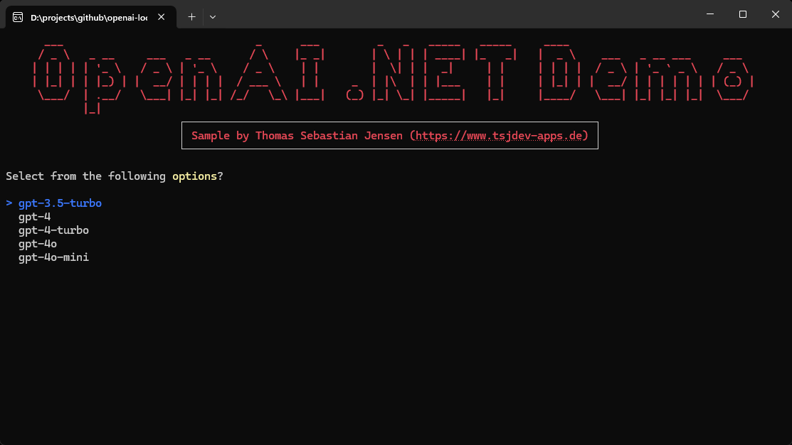
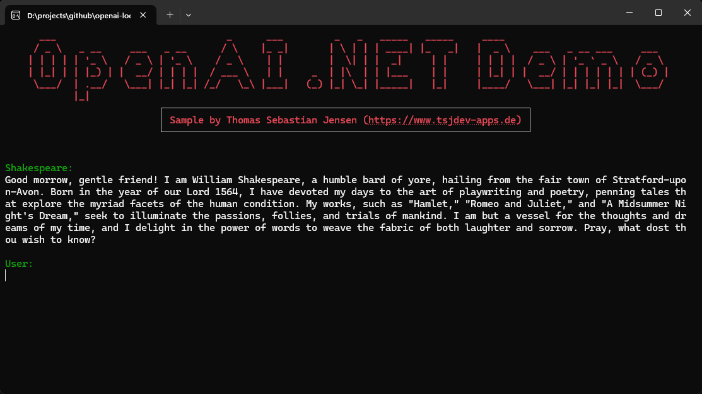
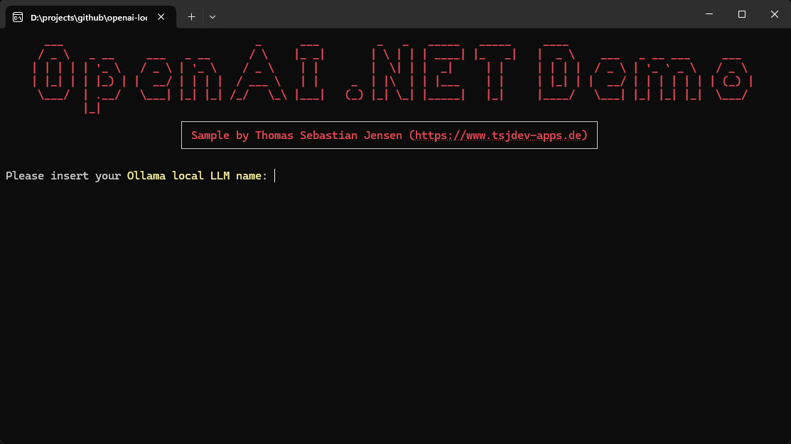
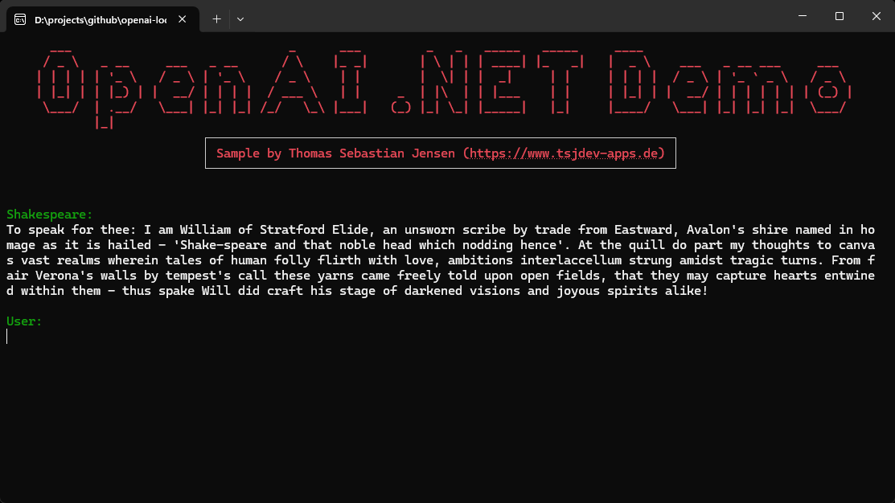

# Using the official OpenAI library for .NET to access local running LLMs ans SLMs using Ollama or llamafiles

In this repository, we will use the official [OpenAI library for .NET](https://www.nuget.org/packages/OpenAI) to create a simple console application. This application will implement a Shakespearean chat using either *OpenAI*’s models, locally running *LLMs* or *SLMs* with [Ollama](https://ollama.com/) or locally running *LLMs* or *SLMs* as [llamafile](https://github.com/Mozilla-Ocho/llamafile).

## Usage

You need to create an OpenAI account on this [website](https://platform.openai.com/docs/overview). You have to pay to use the API so make sure that you add your payment information. After that, you can create an API Key [here](https://platform.openai.com/api-keys) for further use.

If you want to run local LLMs or SLMs simply install [Ollama](https://ollama.com/) and download a desired model.

If you want to run local LLMs or SLM get a `llamafile` from the official [GitHub Repository](https://github.com/Mozilla-Ocho/llamafile). On Windows you need to replace the file extension `.llamafile` with `.exe` to be able to execute the file.

Just run the app and follow the steps displayed on the screen.

## Screenshots

Here you can see the console application in action:

The first screenshot shows the host selection.

Depending on your selection, you will be asked for the required parameters. In this case we need to enter the OpenAI key.

Next we need to select the OpenAI model.

Finally you can start chatting with William Shakespeare.

If you select *Ollama (Local LLM)* as host, you need to specify the downloaded Ollama model.

In my case I’ve downloaded the famous Phi-3 model provided by Microsoft.

Finally you can start chatting with William Shakespeare.

If you select *Llamafile (Local LLM)* as host, you can start directly chatting with Shakespeare.

## Blog Post / YouTube Video

If you are more interested into details, please see the following posts on [medium.com](https://www.medium.com) or in my [personal blog](https://www.tsjdev-apps.de):

- [Using the official OpenAI library for .NET to access llamafile LLMs](https://medium.com/medialesson/using-the-official-openai-library-for-net-to-access-llamafile-llms-c0d8668dbc1d)
- [Using the official OpenAI library for .NET to access local running LLMs ans SLMs](https://medium.com/medialesson/using-the-official-openai-library-for-net-to-access-local-running-llms-ans-slms-dfdbc0f90404)
- [Using Ollama to run local LLMs on your computer](https://medium.com/medialesson/using-ollama-to-run-local-llms-on-your-computer-2e2ee6572a13)
- [Creating a copilot using OpenAI and/or Azure OpenAI](https://medium.com/medialesson/creating-a-copilot-using-openai-and-or-azure-openai-03938fcf7413)
- [Einrichtung von OpenAI](https://www.tsjdev-apps.de/einrichtung-von-openai/)
- [Einrichtung von Azure OpenAI](https://www.tsjdev-apps.de/einrichtung-von-azure-openai/)
